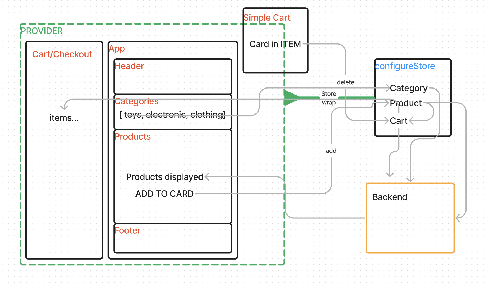

# Storefront - Phase 4 Redux Toolkit

**Author:** Francisco Sanchez

## Overview

Application that can be used to manage the state of a storefront. The application will be built in multiple phases, incrementally introducing new state management techniques and refactoring the code base along the way. The application will have the ability to add and remove items from a virtual shopping cart, checkout and edit the cart contents. The application will also have a live-updating product list, with product details being fetched from a remote API. The application utilizes Redux Toolkit to manage the state of the application.

## Getting Started

1. Using the terminal, navigate to a location directory of your choosing.
2. Clone [Storefront repository](https://github.com/c0d3cisco/storefront) from GitHub.
3. Run `cp storefront` and `npn install`
4. Run `npm start`. A browser window will open with the React app.

## Testing

Testing was done with Cypress. To run the tests, run `npx cypress open` in the terminal. A Cypress window will open. Follow the prompts to run the E2E tests.

[Cypress Test Results](./cypress/e2e/spec.cy.js)

## Architecture

Phase 4 UML\

