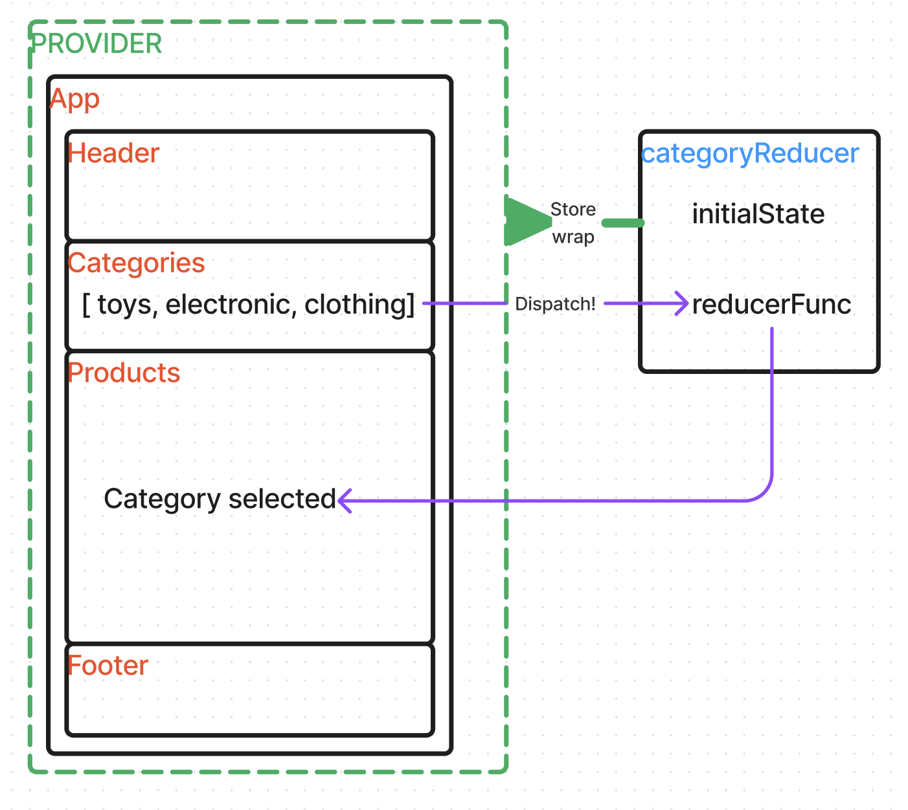

# Storefront - A Redux Story

**Author:** Francisco Sanchez

**Version**: 1.0.0

## Overview

Application that can be used to manage the state of a storefront. The application will be built in multiple phases, incrementally introducing new state management techniques and refactoring the code base along the way.

## Feature Tasks & Requirements

July 6, 2023 - v1.0.0 - Phase 1\
Today, we begin the first of a 4-Phase build of the Storefront application, written in React. In this first phase, our goal is to setup the basic scaffolding of the application with initial styling and basic behaviors, in place. Predominantly, focus and time was taken to understand Redux and how to implement it in the application.

## Getting Started

1. Using the terminal, navigate to a location directory of your choosing.
2. Clone [Storefront repository](https://github.com/c0d3cisco/storefront) from GitHub.
3. Run `cp storefront` and `npn install`
4. Run `npm start`. A browser window will open with the React app.

## Architecture

Phase 1 UML\

